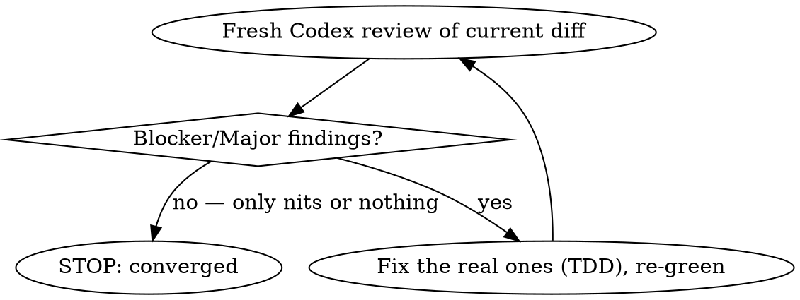

# Code Change and Review

## Overview

A model that writes a diff and then reviews its own diff shares its own blind
spots. This skill runs a **second model (Codex) as an adversarial reviewer in a
loop**: review → fix the real findings (TDD) → review again with *fresh* eyes →
repeat until the reviewer returns no blocking/major issues.

**Core principle:** the loop converges, not the first pass. Each round is
independent eyes on the *current* diff; stop when a fresh reviewer is clean, not
when you are tired of reviewing.

## When to use

- After implementing any non-trivial change where a subtle bug would be costly
  (parsing, auth/authz, state machines, money, migrations, concurrency).
- When the user asks for a Codex review, a "review loop", or a second-model check.
- Before committing work you wrote and want verified by something other than yourself.

**Not for:** trivial/mechanical edits, pure docs, or changes already covered by a
stronger gate. For a single-pass pre-commit pipeline (static scans + one reviewer
+ auto-fix), use `requesting-code-review` instead.

## The loop

1. **Make the change with TDD.** RED test → GREEN → refactor. (REQUIRED:
   `test-driven-development`.)
2. **Get green + scope the diff.** Run the affected tests + lint until clean.
   Identify the exact feature files — *exclude unrelated pre-existing changes in
   the working tree*. The reviewer sees only your diff.
3. **Dispatch ONE Codex reviewer** (see below) on that scoped diff.
4. **Triage the findings — don't auto-implement.** Verify each is real before
   acting. Fix real ones via TDD (write the failing test that reproduces the
   finding first). Note, don't fix, issues outside your diff's scope.
5. **Re-run tests + lint green.**
6. **Dispatch a FRESH Codex reviewer** on the updated diff (independent eyes — not
   the same subagent continued). Go to 4.

**Converged = a fresh reviewer returns no blocker/major.** Address cheap,
legitimate minors; use judgment to avoid chasing infinite subjective nits.

## Dispatching the Codex reviewer

Spawn a subagent (see `subagent-driven-development`) that runs the Codex CLI
non-interactively — `codex exec "<review prompt>"` — WAITS for it to finish,
captures the full stdout, and returns it verbatim. The prompt MUST:

- **Scope it:** list the exact files; tell it to `git diff -- <files>` and read
  new files in full; say to ignore unrelated working-tree changes.
- **Give intent + deliberate decisions:** the feature's goal and the choices that
  are *intentional* (e.g. "this check is unchanged on purpose", "detection is
  best-effort"). Without this the reviewer flags your design as bugs.
- **Demand structure:** each finding as `[BLOCKER|MAJOR|MINOR|NIT] file:line —
  problem — one-line fix`, ending with the exact line `NO BLOCKING/MAJOR ISSUES`
  when clean.
- **Make it relay verbatim:** "run codex non-interactively, WAIT for it to finish,
  capture full stdout, put it in your final message." (Subagents otherwise return
  "composing…" with no findings.)
- **Review-only:** do not modify files.

Each round, spawn a NEW subagent — continuing the same one anchors it on its prior
findings.

## Common mistakes

| Mistake | Fix |
|---|---|
| Reviewing the whole dirty working tree | Scope the review to your feature files explicitly |
| Reviewer flags intentional design as bugs | Put the deliberate decisions in the prompt |
| Blindly implementing every finding | Verify each is real first; fix via TDD |
| Continuing the same review subagent each round | Fresh subagent = independent eyes |
| Subagent returns with no actual findings | Tell it to WAIT for codex and relay stdout verbatim |
| `pytest ... \| tail` "passes" | The pipe masks the exit code — read the real summary line |
| Blaming your change for a pre-existing/flaky failure | Reproduce in isolation / on a clean tree before fixing |
| A quick fix introduces a lint/anti-pattern regression | Re-run lint after every fix, not just at the end |
| Stopping after one review | Loop until a *fresh* reviewer is clean |
